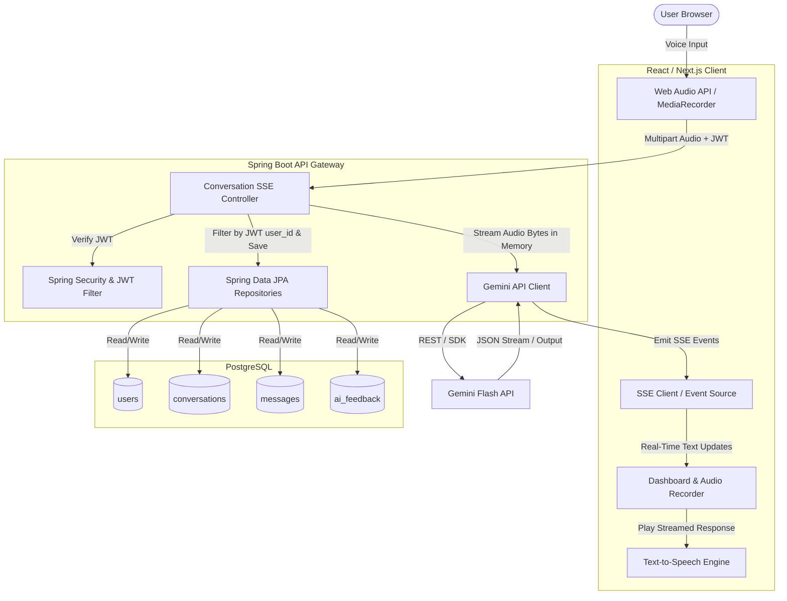
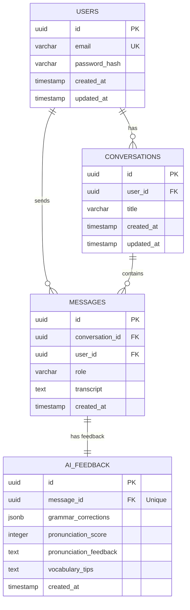
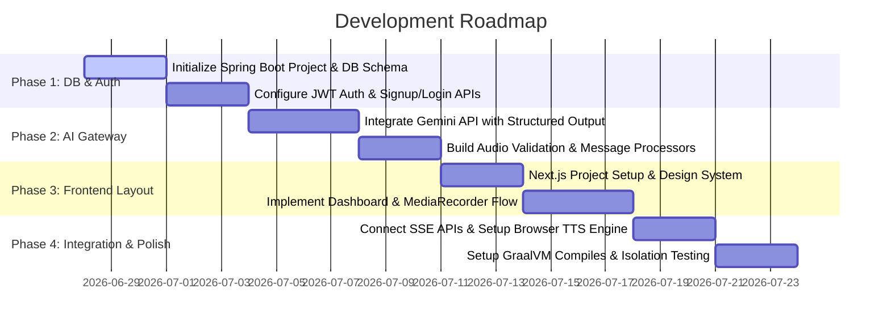

# Product Requirements Document & Technical Blueprint
## AI English Communication Coach (Multi-User Platform)

---

## 1. Project Objective

The **AI English Communication Coach** is a web-based, multi-user platform designed to help English learners practice and improve their conversational skills. Users can log in, have interactive voice conversations with an AI, and receive real-time, constructive feedback on their grammar, vocabulary, and pronunciation, alongside a natural conversational response to keep the dialogue flowing.

### Key Goals:
1. **Interactive Conversations:** Simulate real-life conversations using voice-to-voice loops (Voice Input $\rightarrow$ AI Analysis & Feedback $\rightarrow$ Text-to-Speech Output).
2. **Actionable Feedback:** Provide structural grammar corrections, vocabulary enhancements, and pronunciation feedback.
3. **Multi-User Isolation:** Ensure strict security and privacy so users can only access their own conversation history and feedback records.
4. **Real-time & Low-Latency Processing:** Minimize perceived latency via streaming response events (Server-Sent Events) and non-blocking background I/O.
5. **Cost-Efficient Hosting:** Optimize system resources for free-tier web hosting through compilation as a native binary and lightweight concurrent execution.

---

## 2. System Architecture & Tech Stack

The application employs a decoupled frontend-backend architecture with a secure database layer and external AI integrations.



### Frontend Stack:
*   **Framework:** React 19 (Next.js 15 App Router - Client-side components for dashboard interaction).
*   **Styling:** Tailwind CSS (Modern, premium interface utilizing glassmorphism, responsive dashboard layouts, and clean interactive elements).
*   **State Management:** React Context / Hooks for recording states, audio playing status, and active conversation logs.
*   **Audio Recording:** HTML5 Web Audio API and `MediaRecorder` targeting standard formats (e.g., `audio/webm` or `audio/wav`).
*   **Connection Protocol:** Native `EventSource` / SSE listener to consume streaming JSON events from the backend.
*   **Text-To-Speech (TTS):** Browser-native Web Speech API (`SpeechSynthesis`) for local, zero-cost, and low-latency speech generation.

### Backend Stack:
*   **Language & Framework:** Java 21 + Spring Boot 3.4.
*   **Concurrency Model:** Built using **Java 21 Virtual Threads (Project Loom)**. Spring Boot is configured to spawn lightweight virtual threads per HTTP/SSE request (`spring.threads.virtual.enabled=true`), enabling highly scalable, non-blocking I/O when communicating with PostgreSQL and external Gemini API endpoints.
*   **Compilation & Packaging:** Compiled as a **GraalVM Native Image**. This compiles Java bytecode ahead-of-time (AOT) into a native platform executable, resulting in sub-second startup times and extremely low RAM consumption (typically < 50MB RSS), making it optimized for resource-restricted hosting environments.
*   **Security:** Spring Security + JSON Web Tokens (JWT) for stateless authentication.
*   **Database Access:** Spring Data JPA + Hibernate.

### Database & External Services:
*   **Database:** PostgreSQL 16+.
*   **AI Engine:** Google Gemini API (`gemini-1.5-flash` model), chosen for its fast response times, cost-effectiveness, native multi-modal support (direct audio processing), and JSON Schema enforcement.

---

## 3. Database Schema & Application-Level Isolation

To optimize connection pooling performance and minimize overhead associated with connection session-level setups (`SET LOCAL`), data isolation is handled strictly at the **Application Layer** rather than using database-level Row-Level Security (RLS). 

### Strict Audio Memory Constraint
> [!IMPORTANT]
> **Audio Blobs are processed entirely in memory** within the backend heap space and are **never** persisted to the relational database or disk storage. Once the Gemini API finishes parsing the audio and returning the textual feedback/conversational response, the audio buffer is immediately released from memory.

### Database Schema Design



### SQL Schema Definition

```sql
-- Enable UUID extension
CREATE EXTENSION IF NOT EXISTS "uuid-ossp";

-- 1. Users Table
CREATE TABLE users (
    id UUID PRIMARY KEY DEFAULT uuid_generate_v4(),
    email VARCHAR(255) UNIQUE NOT NULL,
    password_hash VARCHAR(255) NOT NULL,
    created_at TIMESTAMP WITH TIME ZONE DEFAULT CURRENT_TIMESTAMP,
    updated_at TIMESTAMP WITH TIME ZONE DEFAULT CURRENT_TIMESTAMP
);

-- 2. Conversations Table
CREATE TABLE conversations (
    id UUID PRIMARY KEY DEFAULT uuid_generate_v4(),
    user_id UUID NOT NULL REFERENCES users(id) ON DELETE CASCADE,
    title VARCHAR(255) NOT NULL,
    created_at TIMESTAMP WITH TIME ZONE DEFAULT CURRENT_TIMESTAMP,
    updated_at TIMESTAMP WITH TIME ZONE DEFAULT CURRENT_TIMESTAMP
);

-- 3. Messages Table
CREATE TABLE messages (
    id UUID PRIMARY KEY DEFAULT uuid_generate_v4(),
    conversation_id UUID NOT NULL REFERENCES conversations(id) ON DELETE CASCADE,
    user_id UUID NOT NULL REFERENCES users(id) ON DELETE CASCADE,
    role VARCHAR(50) NOT NULL CHECK (role IN ('USER', 'ASSISTANT')),
    transcript TEXT NOT NULL,
    created_at TIMESTAMP WITH TIME ZONE DEFAULT CURRENT_TIMESTAMP
);

-- 4. AI Feedback Table
CREATE TABLE ai_feedback (
    id UUID PRIMARY KEY DEFAULT uuid_generate_v4(),
    message_id UUID UNIQUE NOT NULL REFERENCES messages(id) ON DELETE CASCADE,
    grammar_corrections JSONB, -- Stores corrections list [{original: "", correction: "", explanation: ""}]
    pronunciation_score INT CHECK (pronunciation_score BETWEEN 0 AND 100),
    pronunciation_feedback TEXT,
    vocabulary_tips TEXT,
    created_at TIMESTAMP WITH TIME ZONE DEFAULT CURRENT_TIMESTAMP
);

-- Create Indices for Query Optimization
CREATE INDEX idx_conversations_user ON conversations(user_id);
CREATE INDEX idx_messages_conversation ON messages(conversation_id);
CREATE INDEX idx_messages_user ON messages(user_id);
CREATE INDEX idx_feedback_message ON ai_feedback(message_id);
```

### Application-Level Data Isolation (Replacing RLS)
To guarantee strict isolation without RLS:
1. **JWT Context Extraction:** The authenticated user's `userId` is parsed from the JWT claims during the request security filter and bound to the thread context.
2. **Explicit JPA Repository Filters:** All read, write, and delete queries in Spring Data JPA must explicitly filter by the authenticated user's ID. Native queries or JPQL parameters must be bound to prevent unauthorized queries.

#### Repository Isolation Examples:

```java
@Repository
public interface ConversationRepository extends JpaRepository<Conversation, UUID> {
    
    // Explicitly filter conversations lists by user_id
    List<Conversation> findAllByUserIdOrderByCreatedAtDesc(UUID userId);
    
    // Safely look up a single conversation verifying ownership
    @Query("SELECT c FROM Conversation c WHERE c.id = :id AND c.user.id = :userId")
    Optional<Conversation> findByIdAndUserId(@Param("id") UUID id, @Param("userId") UUID userId);
}
```

```java
@Repository
public interface MessageRepository extends JpaRepository<Message, UUID> {

    // Safely look up message history for a specific conversation verifying user ownership
    @Query("SELECT m FROM Message m JOIN m.conversation c WHERE c.id = :conversationId AND c.user.id = :userId ORDER BY m.createdAt ASC")
    List<Message> findAllByConversationIdAndUserId(@Param("conversationId") UUID conversationId, @Param("userId") UUID userId);
}
```

---

## 4. Backend REST API Endpoints

The Spring Boot backend exposes a stateless REST API secured via standard HTTP Authorization headers (`Bearer <JWT>`).

### 1. Authentication Endpoints
*   `POST /api/auth/signup`
    *   **Description:** Register a new user.
    *   **Request Body:**
        ```json
        {
          "email": "student@example.com",
          "password": "StrongPassword123"
        }
        ```
    *   **Response (201 Created):**
        ```json
        {
          "message": "User registered successfully",
          "userId": "d748f3b2-70b9-42b7-89fb-c58b1bbd1234"
        }
        ```
*   `POST /api/auth/login`
    *   **Description:** Authenticate user and issue a JWT token.
    *   **Request Body:**
        ```json
        {
          "email": "student@example.com",
          "password": "StrongPassword123"
        }
        ```
    *   **Response (200 OK):**
        ```json
        {
          "token": "eyJhbGciOiJIUzI1NiIsInR5cCI6IkpXVCJ9...",
          "expiresIn": 86400,
          "email": "student@example.com"
        }
        ```

### 2. Conversation Management Endpoints
*   `GET /api/conversations`
    *   **Description:** Retrieve a list of conversations for the authenticated user.
    *   **Response (200 OK):**
        ```json
        [
          {
            "id": "e229f3b2-70b9-42b7-89fb-c58b1bbd5678",
            "title": "Discussion about traveling in Europe",
            "createdAt": "2026-06-27T10:30:00Z"
          }
        ]
        ```
*   `POST /api/conversations`
    *   **Description:** Start a new conversation.
    *   **Request Body:**
        ```json
        {
          "title": "Job Interview Prep"
        }
        ```
    *   **Response (201 Created):**
        ```json
        {
          "id": "f529f3b2-70b9-42b7-89fb-c58b1bbd9012",
          "title": "Job Interview Prep",
          "createdAt": "2026-06-27T10:34:00Z"
        }
        ```
*   `GET /api/conversations/{conversationId}`
    *   **Description:** Get full history of a specific conversation (messages & respective AI feedback). Ensures application-level user context matching.
    *   **Response (200 OK):**
        ```json
        {
          "id": "f529f3b2-70b9-42b7-89fb-c58b1bbd9012",
          "title": "Job Interview Prep",
          "messages": [
            {
              "id": "a119f3b2-70b9-42b7-89fb-c58b1bbd1111",
              "role": "USER",
              "transcript": "Hello, I am wanting to applying for the software engineer position.",
              "createdAt": "2026-06-27T10:34:10Z",
              "feedback": {
                "grammarCorrections": [
                  {
                    "original": "I am wanting to applying",
                    "correction": "I want to apply",
                    "explanation": "State verbs like 'want' are generally not used in the continuous form, and 'to' should be followed by the base verb form."
                  }
                ],
                "pronunciationScore": 85,
                "pronunciationFeedback": "Overall clear, but watch the phrasing of 'engineer'.",
                "vocabularyTips": "Instead of 'position', you can also say 'role' or 'job opening' for variety."
              }
            },
            {
              "id": "b229f3b2-70b9-42b7-89fb-c58b1bbd2222",
              "role": "ASSISTANT",
              "transcript": "Great! I'd be happy to help you prepare. Can you tell me a little bit about your past experience with React?",
              "createdAt": "2026-06-27T10:34:15Z",
              "feedback": null
            }
          ]
        }
        ```

### 3. Voice Processing & Interactive Streaming
*   `POST /api/conversations/{conversationId}/messages`
    *   **Description:** Upload user spoken audio. Utilizes Server-Sent Events (SSE) to stream updates dynamically back to the client. This breaks down processing latency by emitting chunks as they are generated by the backend and the Gemini API.
    *   **Request (Multipart Form Data):**
        *   `audio`: File (binary blob, e.g., `.wav`, `.webm`). Handled completely in-memory (e.g. `byte[]` or `InputStream`) and never stored in files or databases.
    *   **Response (200 OK - Content-Type: `text/event-stream`):**
        Streams structured response events to the client:
        
        1. **`user_transcript` Event:** Emitted as soon as the initial voice transcription is retrieved.
           ```json
           {
             "transcript": "Hello, I am wanting to applying for the software engineer position."
           }
           ```
        2. **`grammar_feedback` Event:** Emitted when the detailed grammar, pronunciation, and vocabulary analysis is processed.
           ```json
           {
             "grammarCorrections": [
               {
                 "original": "I am wanting to applying",
                 "correction": "I want to apply",
                 "explanation": "State verbs like 'want' are generally not used in the continuous form, and 'to' should be followed by the base verb form."
               }
             ],
             "pronunciationScore": 85,
             "pronunciationFeedback": "Overall clear, but watch the phrasing of 'engineer'.",
             "vocabularyTips": "Instead of 'position', you can also say 'role' or 'job opening'."
           }
           ```
        3. **`assistant_response_chunk` Event:** Emitted character-by-character or word-by-word as the conversational reply is streamed.
           ```json
           { "chunk": "Great! " }
           ```
           *(Repeated chunks emit until completion)*
        4. **`done` Event:** Emitted when transactions are complete and database record IDs are finalized.
           ```json
           {
             "userMessageId": "a119f3b2-70b9-42b7-89fb-c58b1bbd1111",
             "assistantMessageId": "b229f3b2-70b9-42b7-89fb-c58b1bbd2222"
           }
           ```

---

## 5. Gemini API & TTS Integration Design

The Gemini API serves as both the transcriber and the conversational engine.

### Gemini API Call Schema
We will interact with `gemini-1.5-flash` using a system instruction and a strict JSON schema definition using standard structured outputs.

#### 1. API System Instruction:
> "You are an expert English language coach. You are talking to a student learning English.
> You will receive an audio file of the student speaking.
> Your task is to:
> 1. Transcribe the audio exactly.
> 2. Analyze the grammar, sentence structure, and word choices. Identify errors and explain them concisely.
> 3. Assess the pronunciation/intonation based on the clarity of speech in the audio.
> 4. Formulate a natural, encouraging conversational response that replies directly to the student's statement and prompts them to continue talking. Keep your conversational response relatively concise (2-3 sentences max) so it is ideal for text-to-speech feedback."

#### 2. JSON Schema Enforcement Structure:
The request to Gemini will configure `response_mime_type` to `application/json` with the following schema:
```json
{
  "type": "OBJECT",
  "properties": {
    "user_transcript": { "type": "STRING" },
    "grammar_corrections": {
      "type": "ARRAY",
      "items": {
        "type": "OBJECT",
        "properties": {
          "original": { "type": "STRING" },
          "correction": { "type": "STRING" },
          "explanation": { "type": "STRING" }
        },
        "required": ["original", "correction", "explanation"]
      }
    },
    "pronunciation_score": { "type": "INTEGER" },
    "pronunciation_feedback": { "type": "STRING" },
    "vocabulary_tips": { "type": "STRING" },
    "assistant_response": { "type": "STRING" }
  },
  "required": ["user_transcript", "grammar_corrections", "pronunciation_score", "pronunciation_feedback", "vocabulary_tips", "assistant_response"]
}
```

### Flow of Execution in Backend (Using SSE and Virtual Threads):
1. **Receive Audio:** Spring Boot Controller receives `audio/webm` file bytes on a virtual thread. 
2. **Buffer in Memory:** Store the audio bytes strictly in a temporary memory buffer (`ByteArrayResource`).
3. **Execute Async Gemini Request:** Send a REST request containing the raw audio bytes to Gemini Flash, instructing it to stream the JSON structured response.
4. **Read Stream & Dispatch SSE events:**
    * Parse the incoming Gemini JSON stream.
    * As soon as `user_transcript` is parsed, push the `user_transcript` SSE event to the client.
    * Once the evaluation properties (`grammar_corrections`, `pronunciation_score`, etc.) are parsed, push the `grammar_feedback` SSE event.
    * Stream the `assistant_response` tokens to the client via `assistant_response_chunk` events as they are read from the Gemini stream.
5. **Database Transaction:** In a single database transaction, using Spring Data JPA repository filters containing the authenticated `userId`:
    * Persist User Message (`role = 'USER'`, `transcript = user_transcript`).
    * Persist feedback (`grammar_corrections`, `pronunciation_score`, etc.) linked to the User Message.
    * Persist Assistant Reply (`role = 'ASSISTANT'`, `transcript = assistant_response`).
6. **Emit Done & Close:** Push the `done` event containing message IDs to client and complete the SSE connection. Ensure all temporary in-memory audio buffers are cleared.

### Frontend Text-to-Speech (TTS) Flow:
As SSE events are received:
1. Render transcription (`user_transcript`) and evaluation feedback cards (`grammar_feedback`) dynamically on the dashboard.
2. Accumulate the incoming text chunks from `assistant_response_chunk` to compile the assistant's response.
3. The frontend can begin Web Speech synthesis sequentially as sentences finish buffering, or compile the complete text and speak it immediately upon receiving the `done` event:
   ```javascript
   const utterance = new SpeechSynthesisUtterance(accumulatedAssistantText);
   utterance.lang = 'en-US';
   const voices = window.speechSynthesis.getVoices();
   const naturalVoice = voices.find(voice => voice.lang.startsWith('en') && voice.name.includes('Google'));
   if (naturalVoice) utterance.voice = naturalVoice;
   window.speechSynthesis.speak(utterance);
   ```

---

## 6. Key Security Considerations

1.  **API Key Safety:**
    *   **CRITICAL:** Under no circumstances should the Gemini API key be sent to or stored in the frontend client.
    *   The Spring Boot application loads the API key on startup from system environment variables (`GEMINI_API_KEY`) and communicates with Google's API servers securely from the backend.
2.  **CORS (Cross-Origin Resource Sharing):**
    *   The Spring Boot backend will restrict CORS policies to only permit requests from the validated frontend domain (e.g., `http://localhost:3000` in development). Avoid using wildcards (`*`) for authenticated endpoints.
3.  **Audio File Validation & Memory Protections:**
    *   To prevent memory exhaustion attacks, the backend must limit file upload sizes to a maximum of 5MB (validated instantly by checking the request content-length header).
    *   The MIME type of the uploaded file must be validated against a whitelist of acceptable formats (`audio/webm`, `audio/wav`, `audio/ogg`, `audio/mp3`, `audio/m4a`).
4.  **JWT Authentication Security:**
    *   Use HMAC-SHA256 or RSA signatures for JWTs with a short expiration window (e.g., 24 hours).
    *   Ensure JWT verification happens early in the request filter chain.
5.  **SQL Injection & Application-Level Isolation Security:**
    *   Use parameterized queries (via JPA and repository query annotations) for all DB reads and writes.
    *   Strictly verify that the `userId` extracted from the JWT security context matches the query arguments. Under no circumstances should database reads/writes occur without specifying `userId` in the JPA parameters.

---

## 7. Step-by-Step Development Roadmap



### Phase 1: Database Setup and User Authentication
*   Configure the local PostgreSQL server and run the schema setup migration scripts.
*   Initialize the Spring Boot project with Virtual Threads enabled and include dependencies (`Spring Web`, `Spring Security`, `Spring Data JPA`, `PostgreSQL Driver`, `Lombok`).
*   Implement user registration, password hashing (BCrypt), JWT generation, security filtering, and test user endpoints.

### Phase 2: AI Engine and Session Management Backend
*   Implement Spring Data JPA repositories with explicit `userId` query parameter binding.
*   Integrate Gemini Flash client into Spring Boot. Configure JSON streaming schema parser.
*   Build the in-memory audio processing stream controller (`POST /api/conversations/{id}/messages`) returning Server-Sent Events.

### Phase 3: Frontend Dashboard and Web Audio Controller
*   Initialize the Next.js project with Tailwind CSS. Create a premium glassmorphic dashboard layout.
*   Implement the user authentication forms (Login/Signup) using cookies or LocalStorage to persist the JWT token.
*   Develop the **Push-to-Talk** audio recording component. Ensure standard recording logic, visual waveforms during audio recording, and error handling for microphone permissions.

### Phase 4: Full System Integration & Verification
*   Connect the frontend dashboard to the SSE conversation APIs using native browser `EventSource` wrappers.
*   Verify that audio files process purely in-memory and stream transcription and responses dynamically.
*   Incorporate the local SpeechSynthesis Web Speech API on the client side, triggered when a conversation turn completes.
*   Perform GraalVM AOT compilation configuration and profile memory usage. Thoroughly test application-level data isolation parameters to confirm users cannot access data belonging to other accounts.
